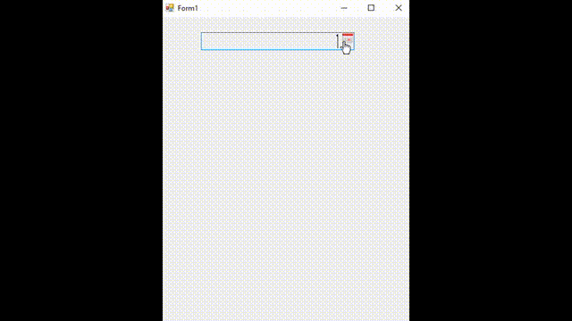

# تقویم فارسی BPersianCalendar برای C# Windows Form

پروژه BPersianCalendar
برای ساخت یک فایل .dll
به منظور استفاده از تقویم فارسی/جلالی/شمسی در فرم‌های ویندوزی ایجاد شده است.

## امکانات

- امکان شخصی سازی فونت تقویم.

- پیاده سازی شده با C# Windows Forms (.NET Framework 3.5)

- برگرداندن تاریخ انتخاب شده در قالب شئ‌ای به نام `DcShamsi` 
که کلاس این شئ امکانات مختلفی ارائه می‌کند.

  

## مستندات

برای آشنایی عمیق‌تر و نحوه‌ی استفاده از امکانات به فولدر 
[Documents](Documents/)
 سر بزنید.

## نحوه‌ی استفاده

**1. افزدن کتابخانه به پروژه خود**

با روش‌های متفاوتی می‌توانید انجام دهید.

- ساده‌ترین روش:

افزودن بسته  نوگت [NuGet Package](https://www.nuget.org/packages/BPersianCalendar) به پروژه‌تان است

  Right click on your project and click 'Manage NuGet Packages...'. 
  
  Search for 'BPersianClendar' and click on install. 
  
  Once installed the library will be included in your project references. 
  
  (Or install it through the package manager console: 
  PM> `Install-Package BPersianClendar`)

- روش دیگر برای انجام این گام:

cloning the project from GitHub, compiling the library yourself and adding it as a reference.

**2. افزودن BPersianCalendar Components به ToolBox**

  If you have installed the NuGet package, 
  the BPersianClendar.dll file should be in the folder `//bin/Debug`. 
  
  Simply drag the BPersianClendar.dll file into your IDE's ToolBox and all the controls should be added there.

## تصاویر

	PropertiesPanel  
	

	ContextMenuStrip 
	

	تصویر ویژگی انتخاب سریع   
	

	انتخاب ماه 
	

	انتخاب سال 
	

	تاریخ در قالب کامل 
	

## درباره توسعه دهندگان

### Behnam Rajabi

The programmer of versions 1.0.0.0 to 4.0.0.0 .

e-main : bhrajabi@gmail.com

phone  : 09359656582

### Z. Ghane

The programmer of version 5.0.0.0 and later versions.

اگر روزی توسعه دهنده خودش، تصمیم به اشتراک گذاری کدهای منبع خودش در گیت هاب گرفت، قطعا این مخزن پاک خواهد شد.

## لایسنس

به نقل از توسعه دهنده اولیه: فاتحه و صلوات

این کنترل تقویم ساده، رایگان، آزاد و 
[تحت لایسنس](./LICENSE) **[MIT](https://en.wikipedia.org/wiki/MIT_License)** می باشد.

