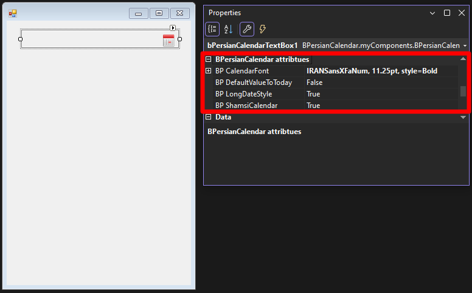
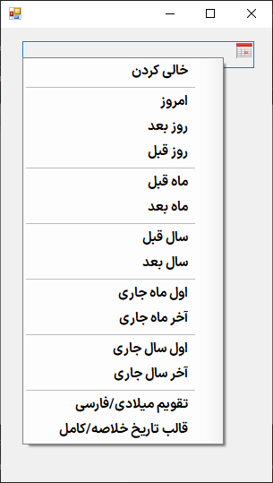
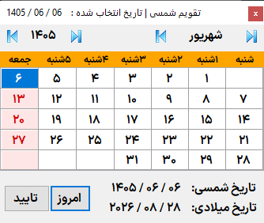
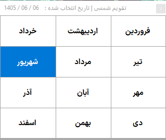
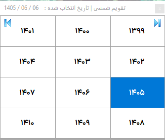
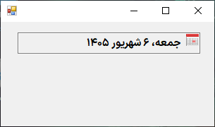
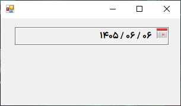
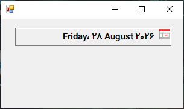
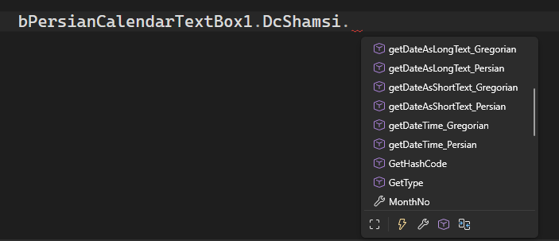

# تقویم فارسی BPersianCalendar برای C# Windows Form

پروژه BPersianCalendar
برای ساخت یک فایل .dll
به منظور استفاده از تقویم فارسی/جلالی/شمسی در فرم‌های ویندوزی ایجاد شده است.

## امکانات

- امکان شخصی سازی فونت تقویم.

- برگرداندن تاریخ انتخاب شده در قالب شئ‌ای به نام `DcShamsi` 
که کلاس این شئ امکانات مختلفی ارائه می‌کند.

## دانلود

برای دریافت و نصب بر بخش `Releases` در کنار صفحه کلیک کنید.

## درباره توسعه دهندگان

### Behnam Rajabi

The programmer of versions 1.0.0.0 to 4.0.0.0 .

e-main : bhrajabi@gmail.com

phone  : 09359656582

### Z. Ghane

The programmer of versions 5.0.0.0 and later.

اگر روزی توسعه دهنده خودش، تصمیم به اشتراک گذاری کدهای منبع خودش در گیت هاب گرفت، قطعا این مخزن پاک خواهد شد.

## License

به نقل از توسعه دهنده اولیه: فاتحه و صلوات

این تقویم ساده، رایگان و آزاد است.

این کنترل رایگان و [تحت لایسنس](./LICENSE) **[MIT](https://en.wikipedia.org/wiki/MIT_License)** می باشد.

## Dependencies

- .Net Framework 3.5

## To create a .dll file

Maybe in bellow situations you want to create a .dll file with different settings:
- you have problems using .dll files that are prepared by us 
- you want to create one with differente settings so that it will be compatible with your .Net Framework, device, etc.

The step by step guide for creating a .dll file (based on Microsoft Visual Studio 2022):

1- Open source code project

2- Select project name

2- RIGHT CLICK on it

3- choose Properties

3- Application

4- Output type: "Class Library"

5- Build > Platform target: << x86 / x64 / Any cpu >>

6- Save

Note: Don't Run it Or you will get Error 

7- Go to "Build" tab

8- Select "Build Solution"

9- Your .dll file is now ready here: "bin > release > BPersianCalendar.dll"

## تصاویر

	PropertiesPanel  
	

	ContextMenuStrip 
	

	تصویر ویژگی انتخاب سریع   
	

	انتخاب ماه 
	

	انتخاب سال 
	

	تاریخ در قالب کامل 
	

	تاریخ در قالب خلاصه 
	

	تاریخ میلادی در قالب کامل 
	

	تاریخ میلادی در قالب خلاصه 
	

	DcShamsi object 
	

